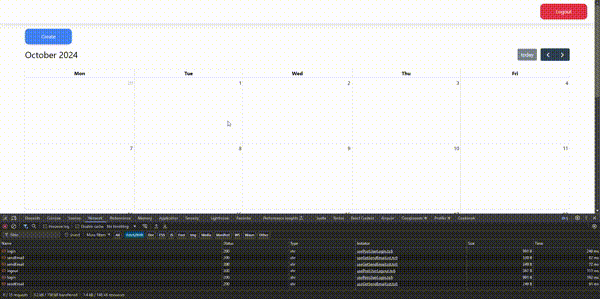

<h1 align="center">Email Scheduler</h1>

<p align="center">This project is an application that displays calendar & email scheduler</p>

---

<br>

### Demo

<h1 align="center">
  
</h1>

## 📱 Features

- React Calendar
- Express JS
- React JS

## 💻 Installation

1. #### Clone the repository:

   ```bash
   git clone https://github.com/fadhildwia/mern-send-email.git
   ```

2. #### Navigate to the project directory:

   ```bash
   cd mern-send-email
   ```

3. #### Navigate to the api directory:

   ```bash
   cd api
   ```

4. #### Install the dependencies:

   ```bash
   npm install
   ```

5. #### Make a copy of `.env.example` to `.env`:
   ```bash
   cp .env.example .env
   ```
6. #### Run the project:

   ```bash
   npm run start
   ```

7. #### Navigate to the client directory:

   ```bash
   cd client
   ```

8. #### Install the dependencies:

   ```bash
   npm install
   ```

9. #### Make a copy of `.env.example` to `.env`:

   ```bash
   cp .env.example .env
   ```

10. #### Run the project:
    ```bash
    npm run start
    ```

<!-- ## License

This example application is licensed under the [MIT License](LICENSE).

--- -->

---

Feel free to explore the code and adapt it to suit your needs! If you encounter any issues or have suggestions for improvements, please don't hesitate to open an issue or submit a pull request.
